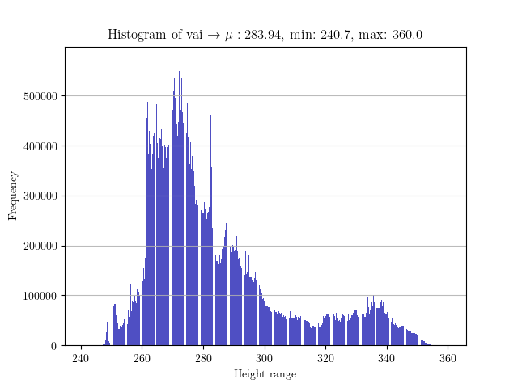
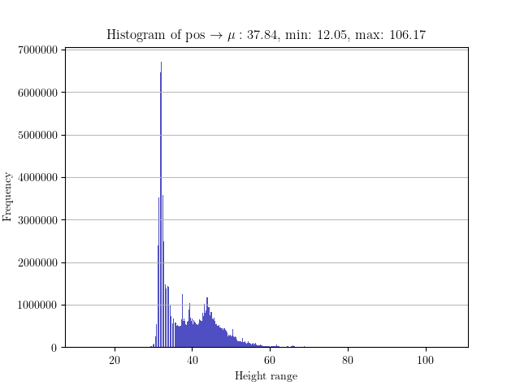

# PotsdamTools
Tools for [Potsdam](<http://www2.isprs.org/commissions/comm3/wg4/2d-sem-label-potsdam.html>) and [Vaihingin](http://www2.isprs.org/commissions/comm3/wg4/2d-sem-label-vaihingen.html) dataset preprocessing.

Dependency:

- tifffile
- numpy
- matplotlib
- PIL
- albumentations

#### Dataloader

- Use Dataloader to load an item of (image, dsm) pairs. This class is easy to use with Pytorch

- Note that **ALL DATA FILES** (RGB images and dsm files) should be placed in the same directory
- Data mode can be selected from "train_data", "test_data" and "all_data" items
- The dataset is divided by .txt files, which can be modified in specific projects

```python
from Dataloader import Posloader
# from Dataloader import Vailoader
#...

class Mydataset(Dataset):
    def __init__(self, transform=None, target_transform=None):
        self.posloader = Posloader("Your_data_path", "data_mode")
        self.posloader.get_pair_data()
        self.transform = transform
        self.target_transform = target_transform

    def __getitem__(self, idx):
        image, dsm = self.posloader.load_item(idx)
        if self.transform:
            image = self.transform(image.astype(np.uint8))
        if self.target_transform:
            dsm = self.target_transform(dsm.astype(np.float32))
        return image, dsm

    def __len__(self):
        return self.posloader.get_data_length()
```

#### GTchecker

Just a script to check DSM ground truth with jet colormap.

```bash
python checkGT.py --dataset_dir=<your_data_path> --data_name=<'pos' or 'vai'> --check_mode=<'vis' or 'sta'>
```

Note that the complete **namefile** has been included in /GTchecker.

The check mode can be selected from Visual mode or Statistical mode, which correspond to 'vis' and 'sta' respectively.

Here we show the result of statistical mode:



